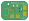

# KiCad-Laser-Pointer-V1
Laser Pointer V1 - A compact, hold-to-activate laser pointer designed in KiCad. 
Accepts a AAA battery, steps up voltage to a steady 3.3V to power a 5mW 650nm Red Adafruit laser module. 

Work in progress as of now. 

